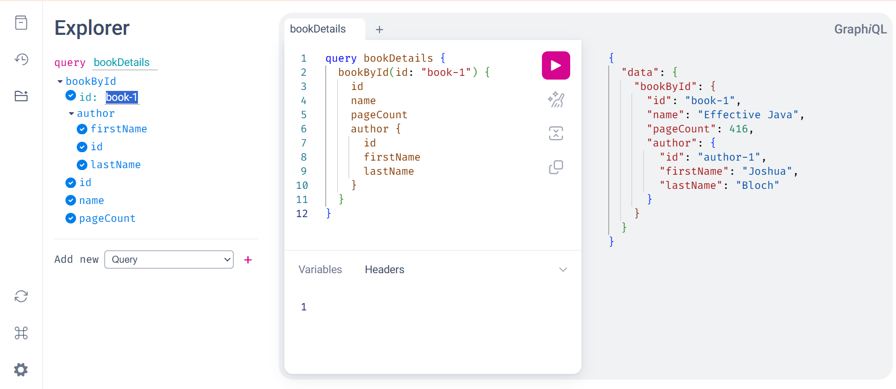

## Building a GraphQL service with Java and Spring

GraphQL is an open-source data query and manipulation language for APIs, and a runtime for fulfilling queries with existing data.

### Requirements

Java 17 or later  
Maven 3.5+

### Quick Setup

```java
git clone [your-repo-url]
cd [local path]
```

Start your Spring application

```java
$ curl -X GET localhost:8080/graphiql
```

### GraphiQL

GraphiQL is a useful visual interface for writing and executing queries, type in the query and click the play button at the top of the window.

```java
query bookDetails {
  bookById(id: "book-1") {
    id
    name
    pageCount
    author {
      id
      firstName
      lastName
    }
  }
}
```


